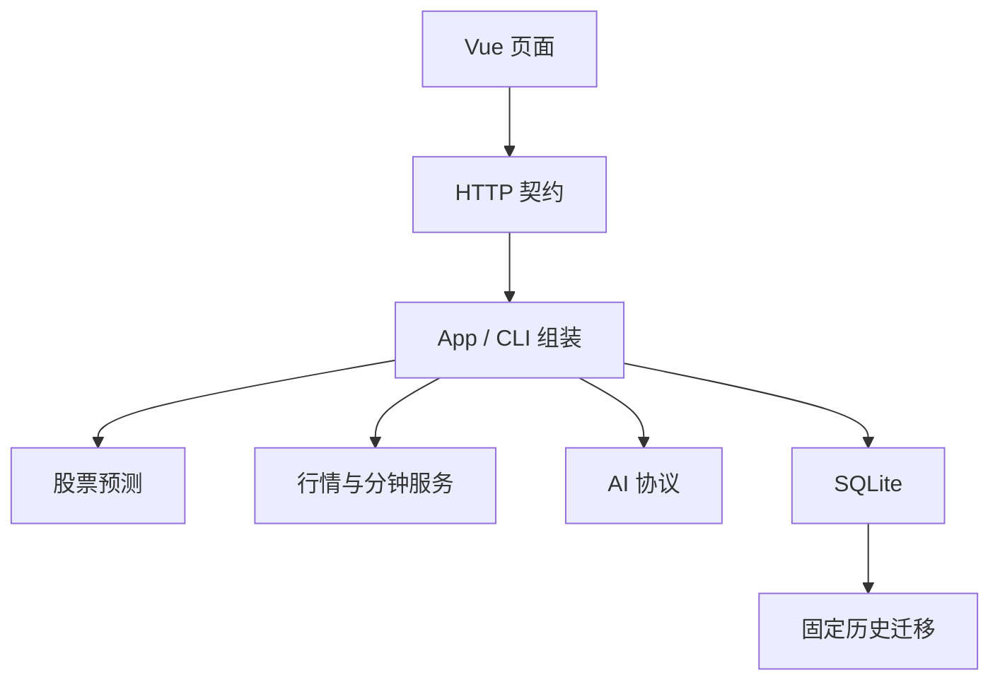

# Stock God 结构与维护边界

产品只保留股票预测、设置、关于三个页面。行情、基金/ETF、分钟数据和 MCP 继续提供数据接口；股票自选、研究中心一、知识库的页面、API、定时任务和模型注入已退役。

## 代码归属

| 位置 | 职责 | 常见改动 |
| --- | --- | --- |
| `src/stock_god/prediction/` | BASE43 特征与滚动训练、单账户、冻结证据、模拟成交、收益、邮件和历史只读 | 策略、资金分配、报表 |
| `src/stock_god/market/` | 行情提供者、来源验证、图表数据、题材、分钟 API/MCP | 数据源、字段解析、数据质量 |
| `src/stock_god/ai/` | 流式模型协议、超时、重试、模型回退 | 模型接入 |
| `src/stock_god/storage/` | SQLite 连接、事务、备份、归档、迁移入口 | 数据安全 |
| `src/stock_god/storage/historical/` | 已发布旧版本的固定升级规则和结构定义 | 仅修复经验证的旧库兼容问题 |
| `app.py` / `cli.py` / `runtime.py` | 依赖组装、HTTP/命令入口、进程和调度生命周期 | 启动、路由、进程恢复 |
| `settings.py` / `audit.py` | 配置快照及 CAS 保存、不可变审计和模型对照回放 | 配置或审计契约 |
| `frontend/src/` | Vue 展示、请求状态、交互图表 | 可视化和交互 |
| `api/openapi.yaml` / `contracts.py` | 公开 HTTP 契约、实际路由检查、生成 TS | 接口增删或 DTO 修改 |

股票预测通过注入的能力调用行情和 AI，不导入其具体实现；行情模块不反向调用预测策略。存储层不导入当前业务。`tests/test_boundaries.py` 使用 Python AST 检查这些关系，包含相对导入和动态模块导入。

## 一次预测的数据流

1. 入口深拷贝配置和模型顺序，建立运行、证据及审计身份。
2. 注入的 MeoZ 来源采集竞价盘口和资格证据；来源、行情及接收时间都保留，盘前输入截止 09:29:59，不完整的输入阻止当天新买入。
3. 固定原 43 列特征和 NaN 语义，以最近五个 BASE43 模型均值评分；只选正分前两名，同分按代码排序。训练仅使用成熟日严格早于预测日的研究参考票标签，不使用账户实际成交收益替代标签。
4. 盘前冻结模型、候选及现金。两席等分、一席全部现金；失败席位留现金，不重分、不补排、不使用当天卖款。
5. 单账户在 09:30 首分钟使用第一份合格实时报价买入，T+1 竞价低开严格小于 −3%时等到 10:30 退出，否则从 09:30 退出；卖出和重启补偿不依赖新报告成功。旧账户停止所有交易、恢复、估值及回放写入。
6. 费用、现金、成交和账本快照同事务提交；收益和图表读取相同账本。

BASE43 权重、原始 ROI 训练种子、尾部样本和 9 月 11 日标签修正随项目保存，固定来源哈希和 sklearn 1.7.2。收盘后更新全部候选标签，日期等权、目标截断 ±15%，发布模型回执与幂等日任务；缺价、未知公司行动和未成熟标签不填零。训练失败不宣称已更新。历史报告与证据不重写，研究条件回放不作为独立样本外收益。

关闭自动策略会撤销新买入许可，已有现役持仓继续退出。错过盘前冻结时点不补发当日买单。归档账户不能通过重新开启策略或模型回放恢复写入。

## 数据兼容

- 工作数据库仍使用 `research2_*` 表、`research2` owner 和历史 UUID 命名空间；显示名改为“股票预测”不改变这些身份。
- 研究中心一、知识库和自选历史数据保留于同一数据库及其归档，当前服务不恢复它们的入口。
- 历史迁移只能由显式数据库命令或受控部署调用，普通页面读取和单元测试不得触发迁移。
- 修改当前费用或策略时，不修改历史迁移内固定的旧算法。需要重算历史时，使用显式预演/应用命令并核对计划哈希。

## 防止再次膨胀

每次改动先确定唯一业务归属，删除被替换的实现及失效入口。只在真实调用需要时抽取公共能力；不为未来研究中心、策略模式或插件增加开关。数据提供者返回事实和来源状态，预测层决定业务结果，前端不重算账户财务规则。

普通任务先运行对应文件测试；跨包契约改变再运行匹配领域检查。新接口、配置、schema、后台任务或较大增量必须说明必要性和长期维护成本。验证流程与发布步骤见 [运行与发布](operations.md)。

本次生产增量超过 200 行的必要性在于完整替代旧评分交易路径：43 特征与五模型训练、MeoZ 原始盘口的单位/时效/资格核验、单账户执行及持久任务恢复缺一不可。维护成本集中在固定特征与模型依赖、提供者契约实测和交易边界回归；不增加并行策略或独立调度器。新增 `meozApiKey` 复用配置快照及 CAS，无独立密钥表；迁移 37 新增三张训练/模型状态表并归档旧账户，旧数据及既有身份契约保留。

09:26起每3秒检查完整候选、43项特征和当日五模型，齐备即冻结输入与现金并发布；缺数据等待至09:29:59，截止仍不齐则不生成买单。成功后当天不重排；信号记录实际冻结时间，模拟买入仍限09:30:00—09:30:59。同一输入与模型快照早晚评分一致，晚到或冲突输入可能改变结果，无需为发布时间重训。
